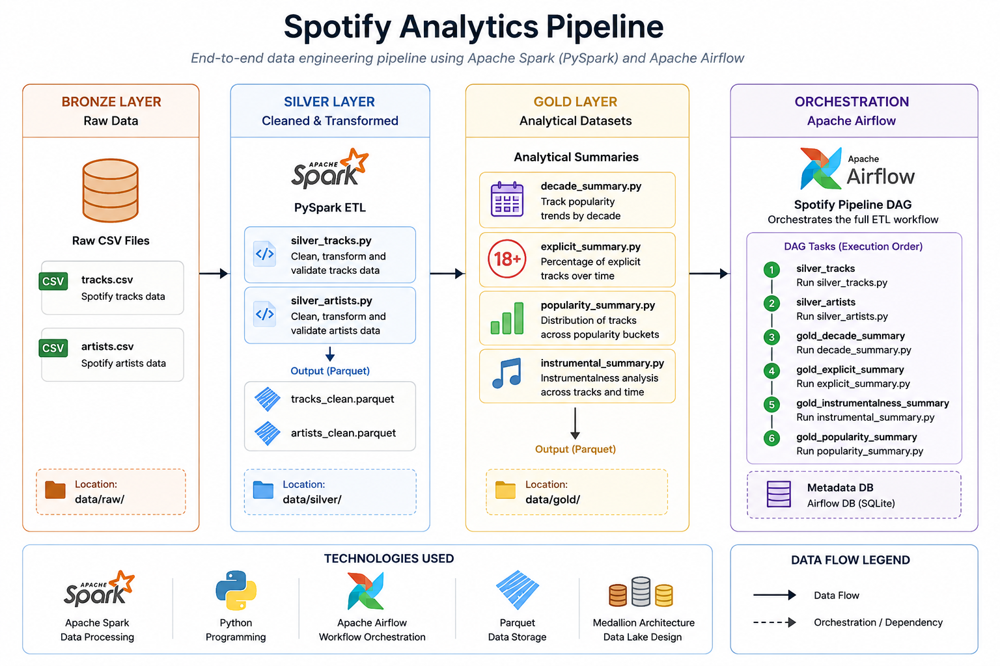
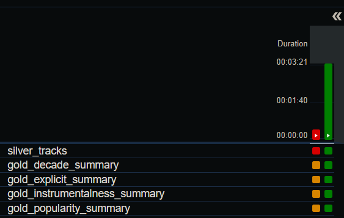

#   Spotify Analytics Pipeline | Data Engineering Project
    *Apache Spark • PySpark • Apache Airflow • Python • Parquet*

## Project Overview

This project implements an end-to-end data engineering pipeline using Apache Spark and Apache Airflow to process Spotify track data.

The pipeline follows the Medallion Architecture (Bronze, Silver, and Gold) transforming raw CSV files into clean analytical datasets stored as Parquet files.

The final Gold layer provides business-ready insights including:
 - Track popularity trends by decade
 - Percentage of explicit music over time
 - Popularity bucket analysis
 - Instrumentalness analysis

 Airflow orchestrates the complete workflow, automating the execution of the Spark ETL pipeline.

## Architecture

The project follows the Medallion Architecture (Bronze → Silver → Gold), with Apache Airflow orchestrating the analytical pipeline.



## Project Structure

```text
spotify-analytics-pipeline/
│
├── airflow/                # Airflow configuration, database and logs
├── dags/                   # Airflow DAG definitions
│   └── spotify_pipeline.py
│
├── data/
│   ├── raw/                # Original Spotify CSV datasets
│   ├── silver/             # Cleaned Parquet datasets
│   └── gold/               # Business-ready analytical datasets
│
├── src/
│   ├── silver/             # PySpark ETL scripts for the Silver layer
│   └── gold/               # PySpark scripts that generate Gold summaries
│
├── screenshots/            # Images used in the README
│
├── requirements.txt
├── README.md
└── .gitignore
```
The project is organized following the Medallion Architecture, separating the ETL process into independent stages. 
This structure improves readability, maintainability, and makes it easier to orchestrate the pipeline with Apache Airflow.

> **Note:** The repository includes a "silver_artists.py" ETL pipeline that generates a cleaned artists detaset. It is intentionally not orchestrated by Apache Airflow because no Gold transformation is depending on it currently.

## How to Run the Project

### 1. Clone the repository

```bash
git clone https://github.com/<your-username>/spotify-analytics-pipeline.git

cd spotify-analytics-pipeline
```

### 2. Create a virtual environment

```bash
python -m venv venv
```

Activate it:

**Windows (PowerShell)**

```powershell
venv\Scripts\activate
```

**Linux / macOS / WSL**

```bash
source venv/bin/activate
```

### 3. Install the dependencies

```bash
pip install -r requirements.txt
```

### 4. Prepare the project

Place the Spotify CSV files inside:

```text
data/raw/
├── tracks.csv
└── artists.csv
```

### 5. Configure Apache Airflow

From the project root:

```bash
export AIRFLOW_HOME=$(pwd)/airflow
airflow db migrate
```

Create an administrator account:

```bash
airflow users create
```

Follow the prompts to create your username and password.

### 6. Start Airflow

Terminal 1:

```bash
export AIRFLOW_HOME=$(pwd)/airflow
airflow scheduler
```

Terminal 2:

```bash
export AIRFLOW_HOME=$(pwd)/airflow
airflow webserver --port 8080
```

Open your browser:

```
http://localhost:8080
```

### 7. Run the pipeline

From the Airflow UI:

- Enable the `spotify_pipeline` DAG.
- Trigger a new DAG run.
- Monitor the execution in the Graph view.

Once the DAG finishes successfully, the analytical datasets will be generated in:

```text
data/gold/
```

## Expected Output

After running the pipeline, the following analytical datasets will be available:

```text
data/gold/
├── decade_summary.parquet
├── explicit_summary.parquet
├── popularity_summary.parquet
└── instrumentalness_summary.parquet
```

## Technologies Used

| Technology | Purpose |
|------------|---------|
| **Python** | Main programming language used to develop the ETL pipeline |
| **Apache Spark (PySpark)** | Distributed data processing and transformations |
| **Apache Airflow** | Workflow orchestration and pipeline scheduling |
| **Parquet** | Columnar storage format for the Silver and Gold layers |
| **Git & GitHub** | Version control and project management |


## Gold Layer

The Gold layer contains business-ready analytical datasets generated from the cleaned Spotify tracks data.

| Dataset | Description |
|---------|-------------|
| **decade_summary.parquet** | Number of tracks and average popularity grouped by release decade. |
| **explicit_summary.parquet** | Percentage of explicit tracks by decade. |
| **popularity_summary.parquet** | Audio feature analysis grouped by popularity buckets (Top Hits, Hits, Very High, High, Medium and Low). |
| **instrumentalness_summary.parquet** | Audio feature analysis grouped by instrumentalness categories. |


## Apache Airflow Orchestration

Apache Airflow orchestrates the complete ETL workflow, ensuring that the Silver layer is generated before executing the independent Gold transformations.

The DAG executes the following workflow:

- Generate the Silver layer (`silver_tracks.py`)
- Execute the four Gold transformations in parallel
- Produce analytical datasets stored as Parquet files




## Future Improvements

Future versions of the project may include:

- Add Gold analytical tables based on artist information.
- Replace duplicated ETL logic with reusable utility modules.
- Add structured logging across the pipeline.
- Containerize the project using Docker.
- Add automated unit and integration tests.


## Key Learnings

During this project I learned how to:

- Design an end-to-end ETL pipeline using the Medallion Architecture.
- Process large datasets with Apache Spark.
- Build analytical datasets using PySpark DataFrames.
- Orchestrate data pipelines with Apache Airflow.
- Organize a data engineering project following production-inspired best practices.


## Author

**Rodrigo Carranza**

Junior Data Engineer

GitHub: https://github.com/rogos14

LinkedIn: https://www.linkedin.com/in/rodrigocarranzau